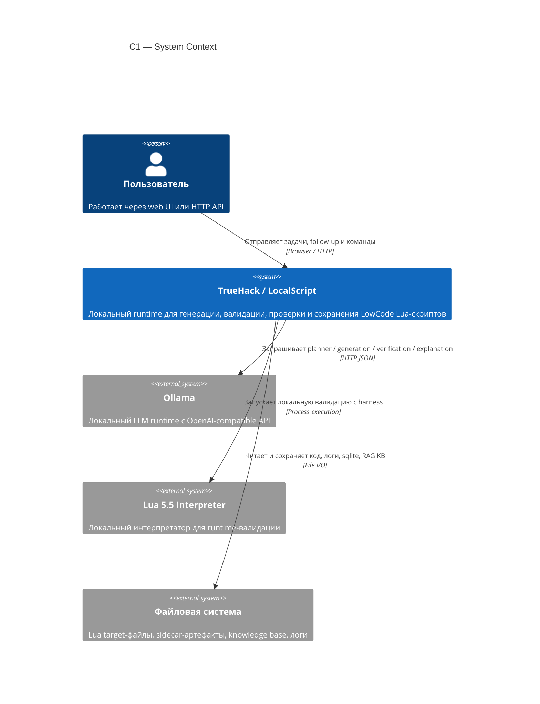
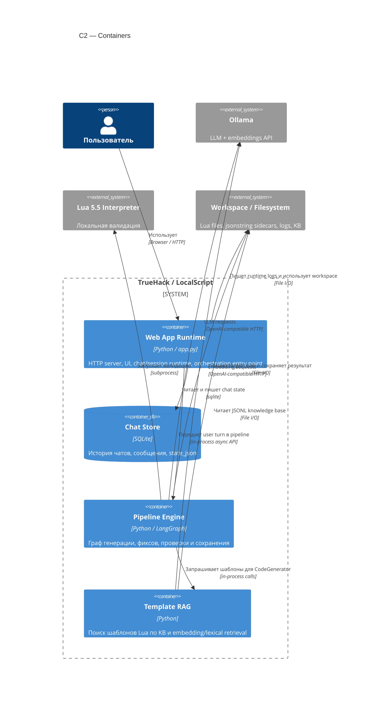
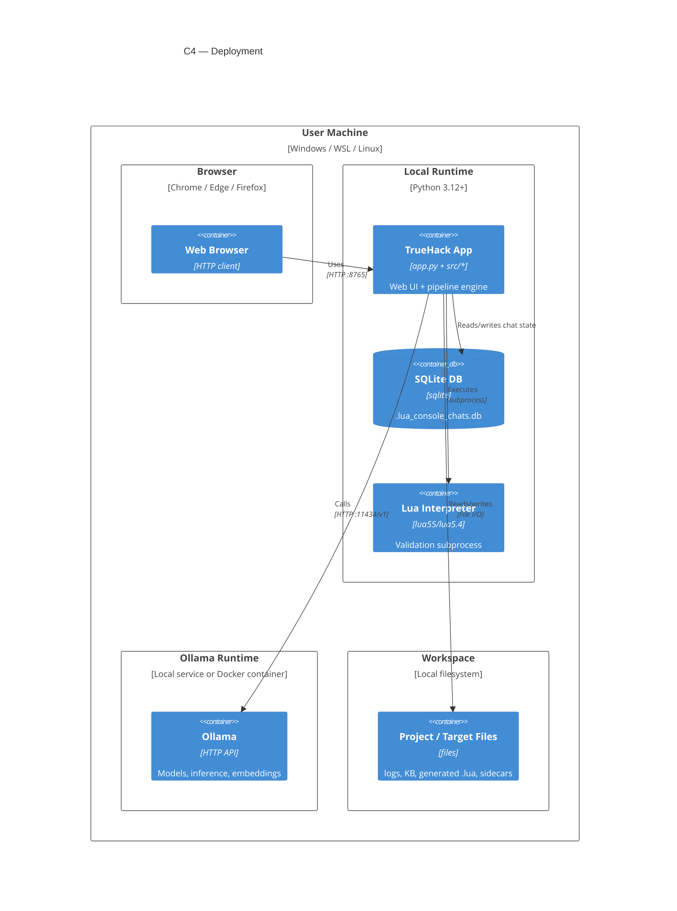

# C4 Architecture

Этот документ описывает проект в нотации C4 на уровнях:
- C1: System Context
- C2: Container
- C3: Component
- C4: Deployment

## C1. System Context

## C2. Container Diagram

## C3. Component Diagram

Ниже показаны основные компоненты внутри контейнера `Web App Runtime + Pipeline Engine`.

```mermaid
C4Component
title C3 — Components

Container_Boundary(app, "Application Runtime") {
    Component(ui_api, "HTTP/UI Layer", "app.py", "Обрабатывает /api/state, /api/message, /api/chats/*")
    Component(runtime, "AppRuntime", "app.py", "Управляет текущим чатом, message flow, background event loop")
    Component(store, "ChatStore", "app.py", "SQLite persistence for chats and messages")
    Component(engine, "PipelineEngine", "src/graph/engine.py", "Готовит initial state и вызывает compiled LangGraph")
    Component(graph_builder, "Graph Builder", "src/graph/builder.py", "Собирает узлы и conditional edges")
    Component(nodes, "Graph Nodes", "src/graph/nodes.py", "resolve/generate/refine/validate/verify/save/explain/respond")
    Component(planner, "Planner Agent", "src/agents/planner.py", "Анализ задачи и цикл уточнений")
    Component(llm, "LLMProvider", "src/core/llm.py", "Единая точка вызова Ollama, per-agent model resolution, concurrency limiting")
    Component(rag, "RAG Templates", "src/tools/rag_templates.py", "Template retrieval and prompt injection")
    Component(lua_tools, "Lua Tools", "src/tools/lua_tools.py", "Prompt compilation, validation, verification, repair helpers")
    Component(target_tools, "Target Tools", "src/tools/target_tools.py", "Resolve/save target files")
    Component(local_runtime, "Local Runtime", "src/tools/local_runtime.py", "Запуск Lua subprocess и decode stdout/stderr")
    Component(conditions, "Routing Conditions", "src/graph/conditions.py", "Переходы между ветками графа")
}

ComponentDb(chatdb, "Chat Store", "SQLite", "История чатов")
System_Ext(ollama, "Ollama", "LLM API")
System_Ext(lua, "Lua Interpreter", "Runtime validation")
System_Ext(fs, "Filesystem", "Workspace, logs, KB")

Rel(ui_api, runtime, "Delegates request handling")
Rel(runtime, store, "Loads/saves chats")
Rel(runtime, engine, "Calls process_message()")
Rel(engine, graph_builder, "Uses compiled graph")
Rel(graph_builder, nodes, "Registers nodes")
Rel(graph_builder, conditions, "Registers conditional routes")
Rel(nodes, planner, "Uses for task planning")
Rel(nodes, llm, "Uses for LLM calls")
Rel(planner, llm, "Uses for planner prompts")
Rel(nodes, rag, "Retrieves template matches")
Rel(nodes, lua_tools, "Uses for compile/validate/verify/fix logic")
Rel(nodes, target_tools, "Uses for target resolution and saving")
Rel(lua_tools, local_runtime, "Runs Lua harness")
Rel(llm, ollama, "chat.completions / embeddings")
Rel(rag, fs, "Reads JSONL KB")
Rel(target_tools, fs, "Reads/writes target files")
Rel(local_runtime, lua, "Executes Lua")
Rel(store, chatdb, "Reads/writes")
Rel(runtime, fs, "Writes logs and uses workspace")
```

## C4. Deployment Diagram

Проект поддерживает два основных режима развертывания: локальный Python runtime и Docker Compose.

## Mapping To Source

- HTTP/UI runtime: [app.py](/mnt/c/Users/Admin/Desktop/3ABCD/TrueHack/app.py:1258)
- Pipeline engine: [engine.py](/mnt/c/Users/Admin/Desktop/3ABCD/TrueHack/src/graph/engine.py:15)
- Graph assembly: [builder.py](/mnt/c/Users/Admin/Desktop/3ABCD/TrueHack/src/graph/builder.py:14)
- Routing conditions: [conditions.py](/mnt/c/Users/Admin/Desktop/3ABCD/TrueHack/src/graph/conditions.py:10)
- Pipeline nodes: [nodes.py](/mnt/c/Users/Admin/Desktop/3ABCD/TrueHack/src/graph/nodes.py:1)
- Planner: [planner.py](/mnt/c/Users/Admin/Desktop/3ABCD/TrueHack/src/agents/planner.py:1)
- LLM adapter: [llm.py](/mnt/c/Users/Admin/Desktop/3ABCD/TrueHack/src/core/llm.py:1)
- RAG templates: [rag_templates.py](/mnt/c/Users/Admin/Desktop/3ABCD/TrueHack/src/tools/rag_templates.py:1)
- Lua validation and verification helpers: [lua_tools.py](/mnt/c/Users/Admin/Desktop/3ABCD/TrueHack/src/tools/lua_tools.py:1)
- Target/file operations: [target_tools.py](/mnt/c/Users/Admin/Desktop/3ABCD/TrueHack/src/tools/target_tools.py:1)
- Local Lua subprocess runner: [local_runtime.py](/mnt/c/Users/Admin/Desktop/3ABCD/TrueHack/src/tools/local_runtime.py:1)
- Docker deployment: [docker-compose.yml](/mnt/c/Users/Admin/Desktop/3ABCD/TrueHack/docker-compose.yml:1), [Dockerfile](/mnt/c/Users/Admin/Desktop/3ABCD/TrueHack/Dockerfile:1)

